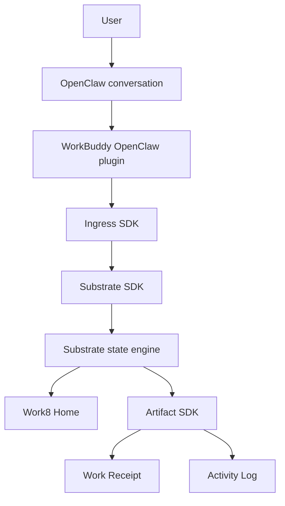

# Work8 Architecture

Work8 is a product shell over the WorkBuddy Agent OS stack.



## Boundaries

### OpenClaw conversation

Primary user entry. It receives the user message and invokes the WorkBuddy hook on real user-message dispatch only.

### WorkBuddy native ingress

Converts a channel envelope into a WorkBuddy task flow:

```text
message
-> FrontdeskRequest
-> Task
-> Work Plan
-> Result
-> Activity Log
-> Work Receipt
```

### Substrate

The source of truth for project, task, result, trace, and pending-change state.

### Work8 Home

Read-only product surface. It shows:

- Current Work
- Needs You
- Delivered
- Runtime State

It does not trigger agents, write substrate state, approve changes, or expose provider secrets.

### Work Receipt

Shareable HTML deliverable generated from redacted substrate projections. It is not the source of truth.

## Runtime Independence

Node2, external API providers, and relay providers are backend profiles. Normal users see only:

```text
WorkBuddy Runtime: Healthy / Degraded / Unknown
```

Historical Home views and receipts should remain available when the provider is offline.
